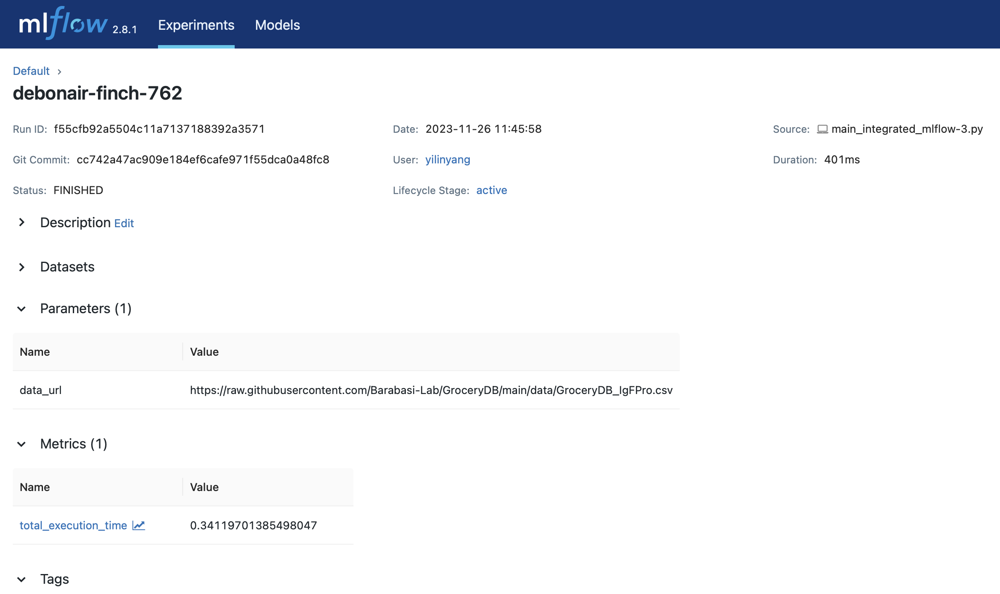
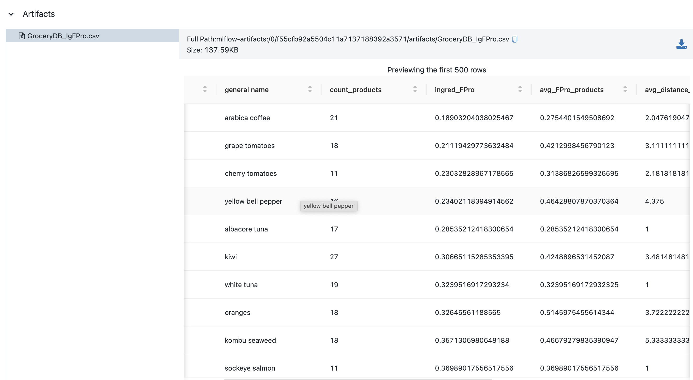
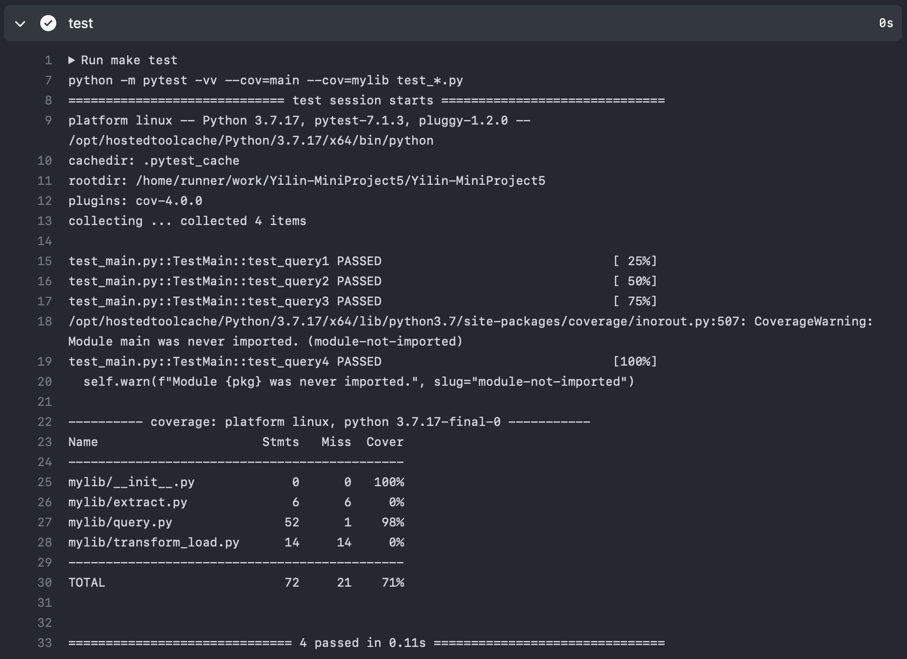

# IDS706 Mini Project12:  Use MLflow to Manage an ML Project

## Project Description

This project is built on previous ETL project [IDS706-MiniProject5-Sqlite](https://github.com/CR72322/Yilin-MiniProject5?classId=277445d6-d907-4562-8732-9dd407ea7a8e&assignmentId=3ded1d1c-b25f-4065-9150-a42b64580df3&submissionId=5d6b3aad-e009-a041-c323-1e006c9069a6) but with MLflow integration. The project is to create a database, perform CRUD operations on the database, and use MLflow to track the operations.
## Features

- Extracts data from a specified source.
- Transforms and loads data into a SQLite database.
- Executes predefined queries on the loaded data.
- Integrated with MLflow for tracking the ETL process.

## MLflow Integration

MLflow is used to track:
- The URL of the data source.
- Total execution time of the ETL and query processes.
- Any other relevant parameters or metrics (placeholders included).
- Artifacts such as output files from the load process.

### How to Run with MLflow Tracking

1. **Start MLflow UI**: Run `mlflow ui` in your command line to start the MLflow tracking UI.
2. **Run the Script**: Execute `python main_integrated.py`. The script will perform the ETL process and log information to MLflow.
3. **View Results**: Open `http://127.0.0.1:5000` in your web browser to view the tracking results in the MLflow UI.

### Result
> Parameters & Metrics

> Artifacts

## How to Run
```bash
python3 main_integrated_mlflow-3.py
```

## Test
```bash
python -m unittest test_main.py
```
